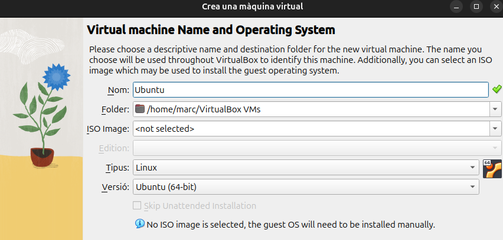

# Intal·lació Ubuntu a VirtualBox

Dins del VirtualBox ens apareixera aquesta seria d'elements.

<img src=(/img/elements.png)

Per afegir una nova màquina seleccionarem nova, i ens apareixera aquesta pestanya on podem posar el nom de la màquina el directori on guardar-la, el tipus i el sistema operatiu.

Seguidament ens apareixeran el hardaware com la memoria base i els número de processadors que volem utilitzar.

Si continuem ens apareixera la mida que li volem donar al disc virtual de la màquina.

Un cop fet aixó ja podrem visualitzar la màquina creada.

Tot i que no ens arrancara si no li posem una ISO amb el sistema operatiu Ubuntu 24.04.1 en el nostre cas.

Per això ens dirigim a l'apartat parametres 

I posarem la ISO del Ubuntu 24.04.1

## Configuració dins la màquina

Un cop fet l'anterior ja podrem executar la màquina, el primer que ens preguntara és l'idioma.

També apareixeran alguna pasos irellebants sobre idioma del teclat, localització etc. 
Pero la part més important és aquesta i nosaltres seleccionarem instal·lació manual.

## Particionatge

Aquesta és la taula de particionatge, he reservat 20GB per l'arrel del sistema que és la que requereix de més emmagatzematge, 16GB pel boot, i 17,68GB pel home que estaria reservat pel archius, fotos, videos etc per l'usuari.

Finalment ens preguntara el teu nom, el nom de l'equip i la contrasenya.

Un cop fet això començara l'instal·lació.

